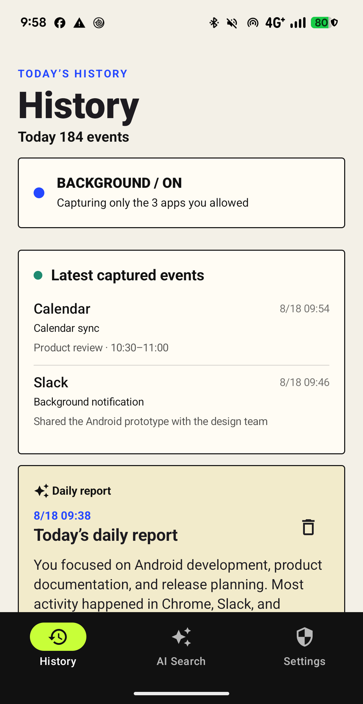
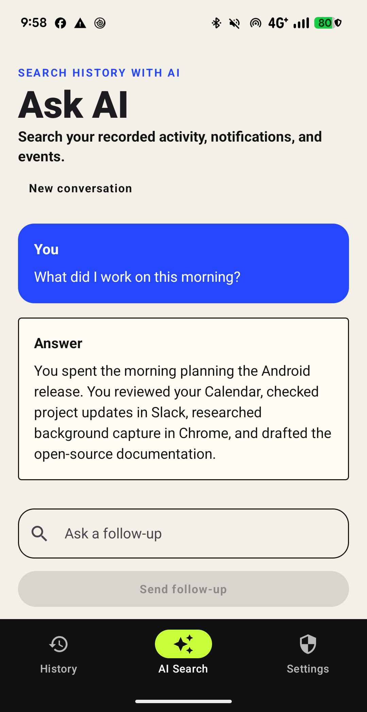
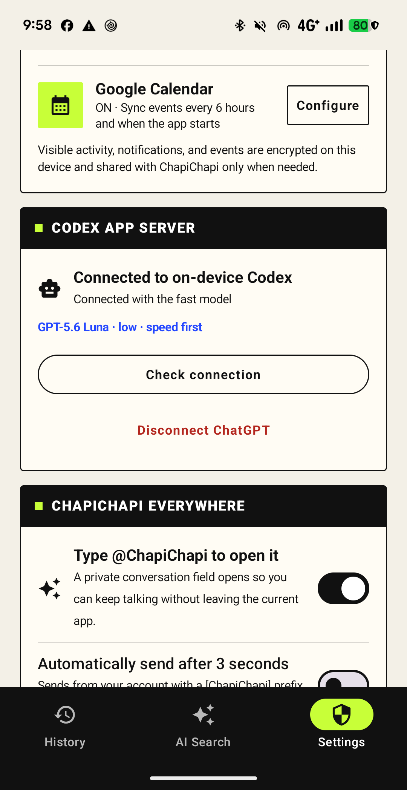
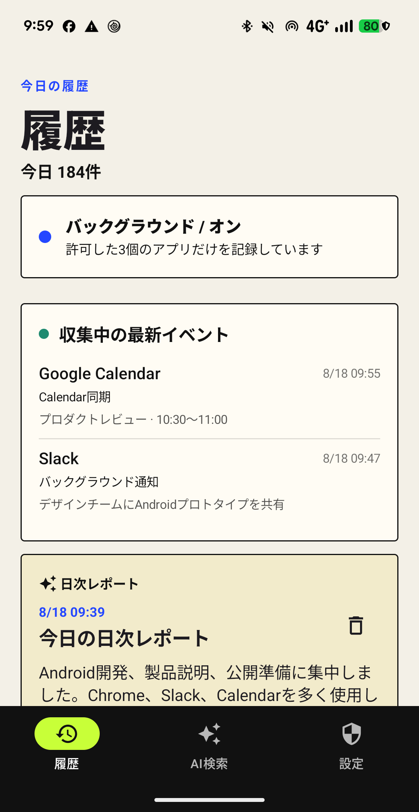
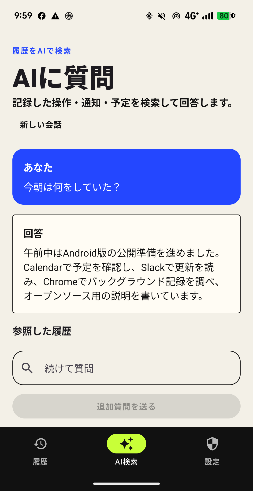
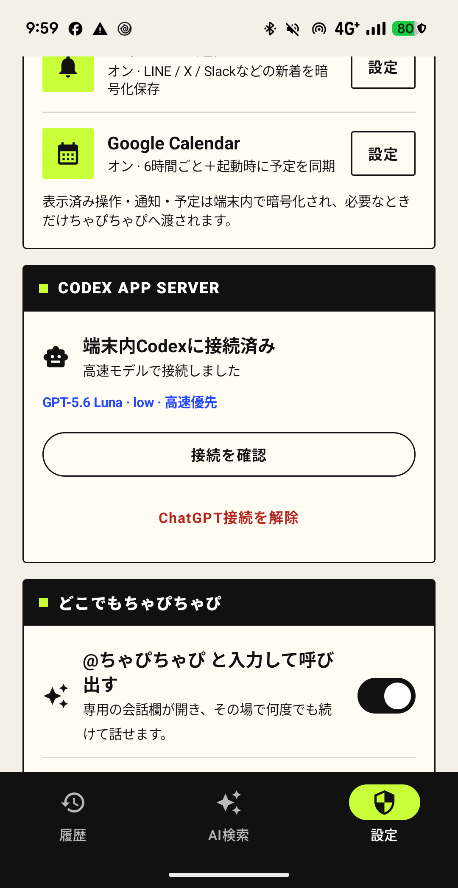
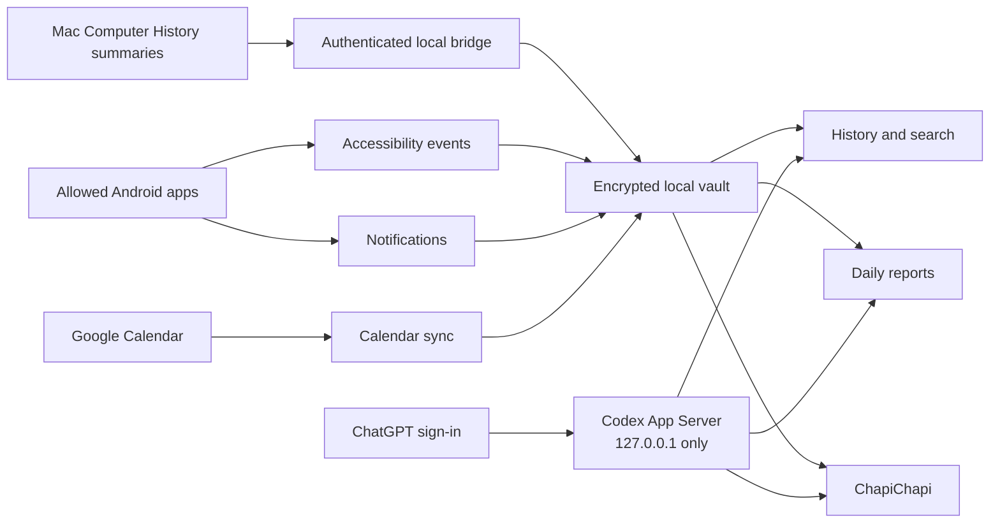

# PLOT

### The Computer History experience, rebuilt for Android.

Current version: **0.1**

PLOT is an independent, open-source Android app that records the activity
Android exposes, encrypts it locally, and turns it into searchable history and
automatic daily reports. It runs Codex App Server directly on the phone, so the
AI connection uses the user's ChatGPT sign-in instead of an API key embedded in
the APK. An optional Mac bridge combines generated Mac Computer History
summaries with the Android timeline, search, and daily report.

As a bonus, type `@ChapiChapi` or `@ちゃぴちゃぴ` in an editable field inside
an allowed app to open a private AI conversation without adding a bot to the
chat.

[**Download the latest signed APK**](../../releases/latest/download/PLOT.apk)
· [Verify its checksum](../../releases/latest/download/PLOT.apk.sha256)

> PLOT is an independent community project. It is not affiliated with or
> endorsed by OpenAI. Codex and ChatGPT are trademarks of OpenAI.

## See it in action

<p align="center">
  
  
  
</p>

<p align="center">
  
  
  
</p>

These screenshots were rendered by the real app on a Pixel Fold using synthetic
demo history. No private messages, notifications, or account data are shown.

## What PLOT does

### 1. Computer History for Android

With explicit consent, PLOT records visible text, page titles, URLs, input
changes, interaction events, permitted notification text, and Calendar events
from allowed apps. The encrypted timeline is searchable immediately, and an
optional automatic report summarizes each day.

### 2. Codex App Server on the phone

Codex App Server runs inside the Android app and listens only on `127.0.0.1`.
Users connect with ChatGPT in the browser-based sign-in flow; normal use needs
neither USB nor a desktop server. History questions use temporary, read-only
Codex threads with approval policy `never`.

### 3. ChapiChapi anywhere

Type `@ChapiChapi` or `@ちゃぴちゃぴ` in an editable field in an allowed app.
PLOT removes the trigger from the draft and opens a dedicated conversation
field above the keyboard. Nothing runs until **Send** is tapped. Answers can be
copied or inserted back into the original field, and the conversation remains
open for follow-up questions.

The default mode never presses the host app's send button. Optional auto-send is
off by default, shows a three-second cancel window, and stops instead of guessing
when it cannot identify one safe send control.

## Architecture



## Privacy boundaries

- Collection stays off until the prominent disclosure is accepted.
- Eligible launchable apps can be enabled together, disabled together, or
  controlled individually.
- Event and memory payloads use an Android Keystore-backed AES-GCM key.
- Raw interaction events are deleted after 48 hours; useful summaries remain.
- Password fields, authenticator apps, password managers, Android permission
  surfaces, and PLOT itself are always excluded.
- Screenshots, camera, microphone, calls, system audio, and clipboard history are
  not captured.
- PLOT does not bypass Android security or retrieve unseen message archives.
- Personal history is sent to an AI connection only when required for the
  requested search, report, or ChapiChapi conversation.
- Mac integration transfers generated 10-minute and 6-hour summaries over
  certificate-pinned HTTPS. Raw Mac events never leave the Mac.

See [the product and privacy specification](docs/product.md) for the detailed
capture model and known platform limits.

The public [privacy policy](PRIVACY.md), [security policy](SECURITY.md), and
[contribution guide](CONTRIBUTING.md) cover operation and project governance.

## Install

1. Download `PLOT.apk` from the latest GitHub Release.
2. Allow installation from the browser or file manager Android names in the
   prompt, then install the APK.
3. Open PLOT and review the disclosure.
4. Enable its Accessibility service. Notification and Calendar access are
   optional and configured separately.
5. Open **Settings**, choose **Connect ChatGPT**, and finish sign-in.

To combine Mac history, run `npm run install-service` in `mac-bridge`, copy the
pairing code from `~/.plot-history-bridge/bridge.log`, then paste it under
**Settings → Mac Computer History**. Both devices must be reachable on the same
local network; background sync runs every 15 minutes.

The first release link becomes active after this repository is published and a
version tag has produced a GitHub Release.

## Languages

English and Japanese are first-class app languages. On Android 13 or later, use
**Settings → App language → Change in Android settings**. With no app-specific
choice, PLOT follows the device language.

Translations live in:

- `app/src/main/res/values/strings.xml`
- `app/src/main/res/values-ja/strings.xml`
- `app/src/main/res/xml/locales_config.xml`

## Build from source

Requirements: Android SDK 35, JDK 17, `curl`, `shasum`, and an arm64 Android
device for runtime verification.

```bash
./scripts/build-codex-android.sh
./gradlew :app:testDebugUnitTest :app:lintDebug :app:assembleDebug
adb install -r app/build/outputs/apk/debug/app-debug.apk
```

The Codex binary is intentionally excluded from Git. The build script downloads
the pinned arm64 release, verifies its SHA-256 checksum, and packages it locally.

The Android client reads the signed-in account's App Server model catalog and
prefers `gpt-5.6-luna` with low reasoning when available. An authenticated
OpenAI/OpenRouter-compatible gateway remains available as an advanced fallback;
no provider API key is shipped in the APK. See [the gateway contract](docs/gateway-api.md).

## Release a signed APK

Tags matching `v*` trigger `.github/workflows/release-apk.yml`. The workflow
tests the gateway and Android app, downloads the verified Codex binary, builds
with the protected signing key stored in GitHub Actions secrets, verifies the
signature, and publishes:

- `PLOT.apk`
- `PLOT.apk.sha256`

The signing key is never committed. Follow [the release setup guide](docs/releasing.md)
before creating the first tag.

## Distribution note

AccessibilityService usage requires accurate store disclosure. Before any Play
Store release, prepare a public privacy policy, Data Safety declarations,
prominent in-app disclosure, affirmative consent, and an accessibility-use
explanation that matches the shipped behavior.

## Name and icon

**PLOT** refers to plotting the phone's activity into a line that can be searched
and understood. The adaptive launcher icon is a CAD-like construction: blueprint
grid, datum crosshair, plotted `P`, and two deliberately mismatched control
points. The source is deterministic Android vector XML and includes a monochrome
themed-icon layer.

## License

PLOT source code is open source under the [MIT License](LICENSE). Release APKs
also contain OpenAI Codex under Apache License 2.0; see
[third-party notices](THIRD_PARTY_NOTICES.md).
